# Project 2: Design Journey

**For each milestone, complete only the sections that are labeled with that milestone.** Refine all sections before the final submission.

You are graded on your design process. If you later need to update your plan, **do not delete the original plan, leave it in place and append your new plan _below_ the original.** Then explain why you are changing your plan. Any time you update your plan, you're documenting your design process!

**Replace ALL _TODOs_ with your work.** (There should be no TODOs in the final submission.)

Be clear and concise in your writing. Bullets points are encouraged.

Place all design journey images inside the "design-plan" folder and then link them in Markdown so that they are visible in Markdown Preview.

**Everything, including images, must be visible in _Markdown: Open Preview_.** If it's not visible in the Markdown preview, then we can't grade it. We also can't give you partial credit either. **Please make sure your design journey should is easy to read for the grader;** in Markdown preview the question _and_ answer should have a blank line between them.

## Understanding Users (Milestone 1)

**Make the case for your decisions using concepts from class, as well as other design principles, theories, examples, and cases from outside of class.**

You can use bullet points and lists, or full paragraphs, or a combo, whichever is appropriate. The writing should be solid draft quality but doesn't have to be fancy.

### User Interview Questions (Milestone 1)
> Plan the user interview which you'll use to identify the goals of your site's audience.
> You may use the interview template below and revise it as much as you desire.
> You are **required to author 3 of your own questions**.

**User Interview Briefing & Consent:** Hi, I am a student at Cornell University. I'm currently taking a class on web design and for a project, I am re-designing the website for Ithaca's Apple Harvest Festival. I'm trying to learn more about the people that might use this site. May I ask you a few questions? It will take about 10 minutes. You are free to quit at any time.

(These questions assume you are interviewing a festival attendee at the festival. If you didn't attend the festival, you may revise the questions and instead ask the participant to recall the last festival/event they attended. Do not ask them to speculate about visiting the Apple Harvest Festival. User speculation provides biased data.)

1. Please tell me a bit about yourself. You may omit any personal or private information.

2. What brought you to visit the Apple Harvest Festival today?

3. Before you came to the festival today, did you seek out any information about the festival before getting here?
3a. If yes, What information were you specifically looking for? Did you find it? How did you access that information?

4. When you arrived at the festival, did you seek out any information about the festival?
4a. If yes, What was that information? How did you obtain it?

5. Now that you're here participating in the festival, have you sought out information about the festival?
5a. If yes, what was the information and how did you access it?

6. Did you come with a car?
5a. If no, what mode of transportation did you utilize to get here.
7. Did you visit the apple harvest festival?
7a. If yes which device did you use to utilize the website?

...

n. What haven't I asked you today that you think would be valuable for me to know?

**After the interview:** This was really helpful. Thank you so much for agreeing to speak with me today. Have a great day!

### Interview Notes (Milestone 1)
> Interview at least 3 people from your audience. Take notes and include those notes here. Make sure to include a brief description of each interviewee.
> **Copy the interview questions above into each interviewee section below.**
> Take notes for each participant inline with the questions.

**Interviewee 1:**
My first interviewee was a Junior in Ithaca College.

1. Please tell me a bit about yourself. You may omit any personal or private information.

2. What brought you to visit the Apple Harvest Festival today?

3. Before you came to the festival today, did you seek out any information about the festival before getting here?
3a. If yes, What information were you specifically looking for? Did you find it? How did you access that information?

4. When you arrived at the festival, did you seek out any information about the festival?
4a. If yes, What was that information? How did you obtain it?

5. Now that you're here participating in the festival, have you sought out information about the festival?
5a. If yes, what was the information and how did you access it?

6. Did you come with a car?
6a. If no, what mode of transportation did you utilize to get here.

7. Did you visit the apple harvest festival website prior to the fesyival?
7a. If yes which device did you use to utilize the website?

n. What haven't I asked you today that you think would be valuable for me to know?
Answers.

1. I'm a junior at Ithaca college majoring in Computer science.
2. I love apples and everything about apples. But I came here mainly for food and the musical performance.
3. Yes
3a. I wanted to know the days, time and events for the festival. I accessed the information on The Apple Festival Website.
4. No
5. Yes
5a. I inquired about the varoius apple products available, I found that information on the Apple festival website.
6. No
6a. I came with a Tcat bus.
7. Yes, I did.
7a. I accessed the website through my phone.
n. No

**Interviewee 2:**

My second interviewee was a sophomore at Cornelll university

1. Please tell me a bit about yourself. You may omit any personal or private information.

2. What brought you to visit the Apple Harvest Festival today?

3. Before you came to the festival today, did you seek out any information about the festival before getting here?
3a. If yes, What information were you specifically looking for? Did you find it? How did you access that information?

4. When you arrived at the festival, did you seek out any information about the festival?
4a. If yes, What was that information? How did you obtain it?

5. Now that you're here participating in the festival, have you sought out information about the festival?
5a. If yes, what was the information and how did you access it?

6. Did you come with a car?
6a. If no, what mode of transportation did you utilize to get here.

7. Did you visit the apple harvest festival website prior to the festival ?
7a. If yes which device did you use to utilize the website?

n. What haven't I asked you today that you think would be valuable for me to know?
Answers

1. I'm Jason, a sophomore at cornell University. I'm majoring i Economics, I like bowling and reading.
2. I just wanted to experience the festival because I love apples.
3. yes I did,
3a. I wanted to Know the events, time for the events and the payment options available.
4. No
5. Yes
5a. I wanted to know the events for tomorrow, I looked it up on the Apple Harvest Festival
6. No
6a. I came with a Tcat bus
7. Yes, I sure did
7a. I accessed the website with my laptop.
n. No, I think you are good.

**Interviewee 3:**

My last interviewee was a Senior at Cornell university.

1. Please tell me a bit about yourself. You may omit any personal or private information.

2. What brought you to visit the Apple Harvest Festival today?

3. Before you came to the festival today, did you seek out any information about the festival before getting here?
3a. If yes, What information were you specifically looking for? Did you find it? How did you access that information?

4. When you arrived at the festival, did you seek out any information about the festival?
4a. If yes, What was that information? How did you obtain it?

5. Now that you're here participating in the festival, have you sought out information about the festival?
5a. If yes, what was the information and how did you access it?

6. Did you come with a car?
6a. If no, what mode of transportation did you utilize to get here?
6b. If yes, did you get enough information on parking? and where did you access that Information form?

7. Did you visit the apple harvest festival Website prior to the festival?
7a. If yes which device did you use to utilize the website?

n. What haven't I asked you today that you think would be valuable for me to know?
Answers

1. I'm Jane, I'm a senior at Cornell majoring in Environmental Science.
2. I attend the festival every year, I simply love it when there is a lot of varieties of Apples for me to choose from. I also buy some Apple ciders a well.
3. Yes
3a. I checked the events for this year and the time for the events
4. No
5. No
6. Yes
6b. I looked it up on The Apple Harvest Website.
7. Yes
7a. I used my Mobile phone to access the website
n. I think you should have asked if the information I attained on the website was helpful?, In answering that, I think I had the information I needed in the website so it was super helpful.

### Goals (Milestone 1)
> Analyze your audience's goals from your notes above.
> List each goal below. There is no specific number of goals required for this, but you need enough to do the job (Hint: It's more than 2).

Goal 1: Buy apples and other Products made from apples.

- **Design Ideas and Choices** _How will you meet those goals in your design?_
  - Provide them with images and the names of the varietes of apples available
  - Provide images and names of products made from apples that will be available.
  - Provide information on the payment options available.
- **Rationale & Additional Notes** _Justify your decisions; additional notes._
  - Providing the names and images of the varieties of apple available will provide my audience with all the information the will need to satisfy their goals.
  - Providing informationson the various payment options available will be relevant for my Audience because knowing the forms of payments available will help them prapare adequately before they come to the festival.

Goal 2: Explore the available options at the festival.

- **Design Ideas and Choices** _How will you meet those goals in your design?_
  - I will display all the events for the festival
  - A list of available resturants in the commons
  - A list of available shops at the commons
  - Available payment options
- **Rationale & Additional Notes** _Justify your decisions; additional notes._
  - Since this Audience is in to explore the available options for him at the festival, providing a list of all the events lined up for the festival will give my audience a list of options to explore.

Goal 3: Entertainment and food.

design ideas and rationale

- Provide the entertainment options that will be available at the event. some include musical performance and group performances.
- Images of the varieties of food that will be available at the event.
- Information on parking spaces.
- Tcat bus schedule and information on other available means of transport.
- Map that gives direction to the event

add as many goals as needed

- Socialization
- Adventure
- Relaxation

### Audience (Milestone 1)
> Briefly explain your site's audience.
> Be specific and justify why this audience is a **cohesive** group with regard to the Ithaca Apple Harvest Festival.

My sites Audience will be college students living in Ithaca. Based on the interview I conducted , the junior from Ithaca College and the Sophomore from Cornell University are both College students with a similar goal for attending the festival. They both loves apples and every thing thing apples and that made them show up tat the festival to explore the various varieties of apples available and explore other things as well.

## Festival/Event Website Design Exploration (Milestone 1)

Identify three festival or event websites (preferably static websites) that exist today on the web. You will be drawing inspiration from these sites for your own site; please select websites that are similar to the website you wish to create.

Include two screenshots of the home page for each site: narrow and wide.

**We'll refer to these are your "example websites."**

1. <https://www.coachella.com/>

    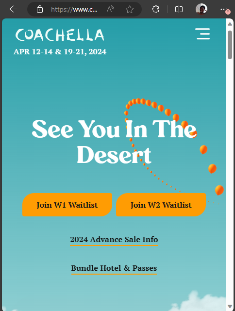

    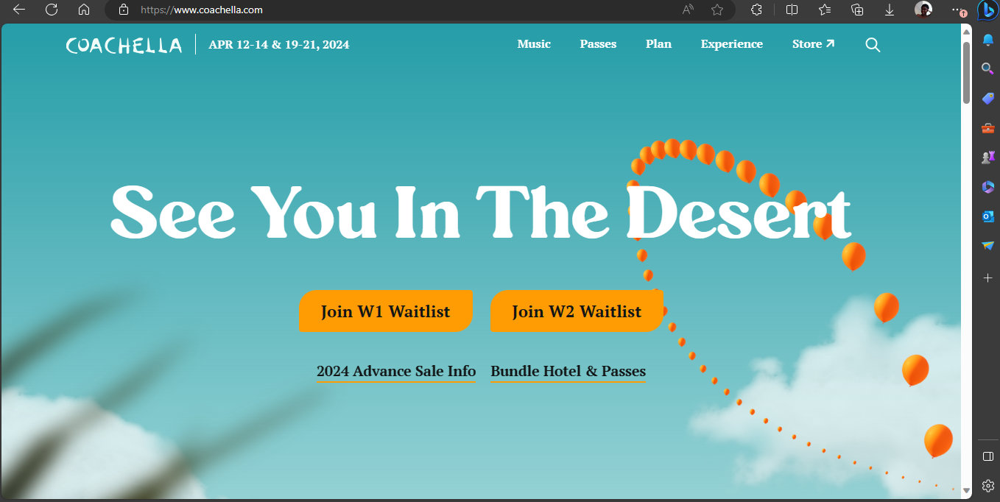

2. <https://renfair.com/ny/>

    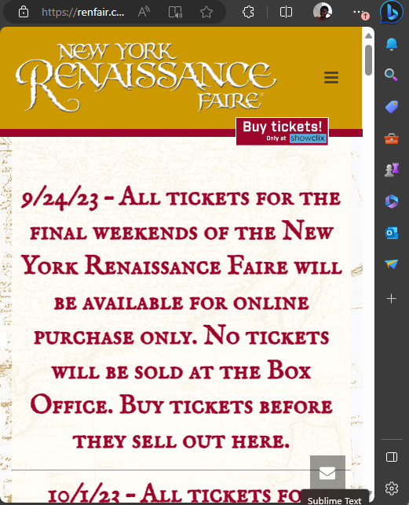

    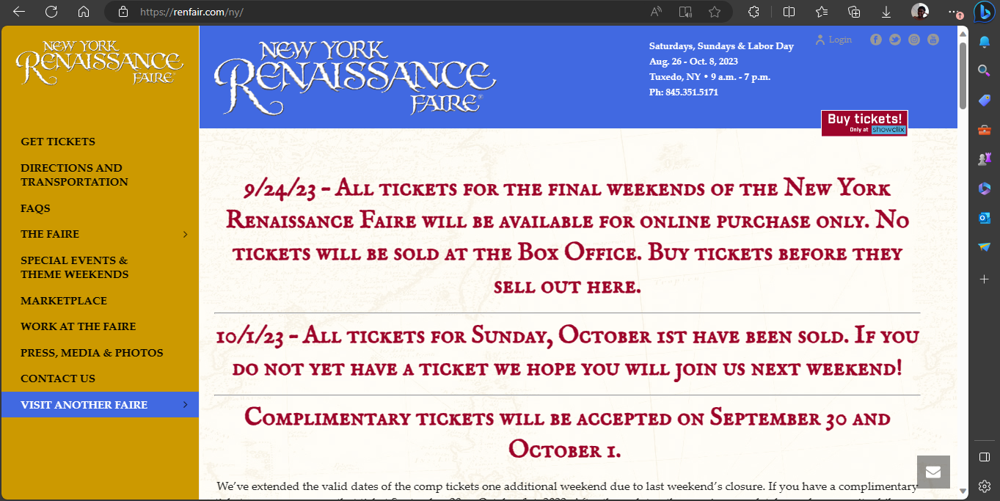

3. <https://www.lollapalooza.com/>

    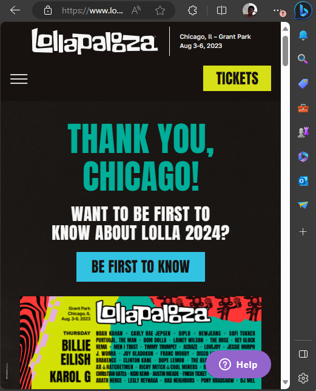

    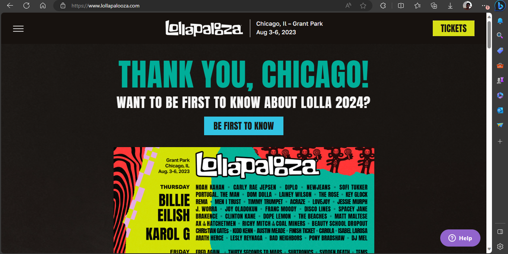

### Festival/Event Website 1 Review (Milestone 1)
> Review the website you identified above. (2-3 sentences)
> In your review, include a discussion common design patterns in the site.

The rounded borders of the images and the color scheme gives a cheerful, soft, cool and a friendly feeling.

### Festival/Event Website 2 Review (Milestone 1)
> Review the website you identified above. (2-3 sentences)
> In your review, include a discussion common design patterns in the site.

The contrast between the colours of the texts and the background was excuted well, and it makes the text legible despite the different background colors. I also think that the screen in too busy, there is text every where, there is no breathing space for the content on the webpage.

### Festival/Event Website 3 Review (Milestone 1)
> Review the website you identified above. (2-3 sentences)
> In your review, include a discussion common design patterns in the site.

I like the color contrast between the text and the background but the text becomes less readable when viwed on a narrow screen.

## Content Planning (Milestone 1)

Plan your site's content.

### Your Site's Planned Content (Milestone 1)
> List **all** the content you plan to include your website.
> You should list all types of content you planned to include (i.e. text, photos, images, etc.)
> **Do not place the content directly in the design journey.** Simply list it here. \
> i.e. Provide a brief description of each piece of content you intend to include.

- History of the festival
- The apple festival logo
- Frequently asked questions
- More local shopping
- Dinning
- Date and location for the festival
- festival hours
- List of events entertainment events on saturday and Sunday
- Direction and parking
- A list os food vendors
- A list of crafters
- Apple harvest festival map
- apple-basket.jpeg
- ...

### Content Justification (Milestone 1)
> Explain (about a paragraph) why this content is the right content for your site's audience and how the content addresses their goals.

This content will provide all the relevant information my audience needs to attend the festival. The text content will provide information on the list of events, time and date, parking information and the images will also provide give my audience an idea on the kind of product that will be avaible at the festival. In summary my content will meet the goals of my audience because it will provide them with all the information thay need to attend the festival.22

## Information Architecture (Milestone 1)

### Content Organization (Milestone 1)
> Document your **iterations** of card sorting here. You must have at least 1 iteration of card sorting.
> Include photographic evidence of each iteration of card sorting **and** description of your thought process for each iteration.
> Please physically sort cards; please don't try and do this digitally.

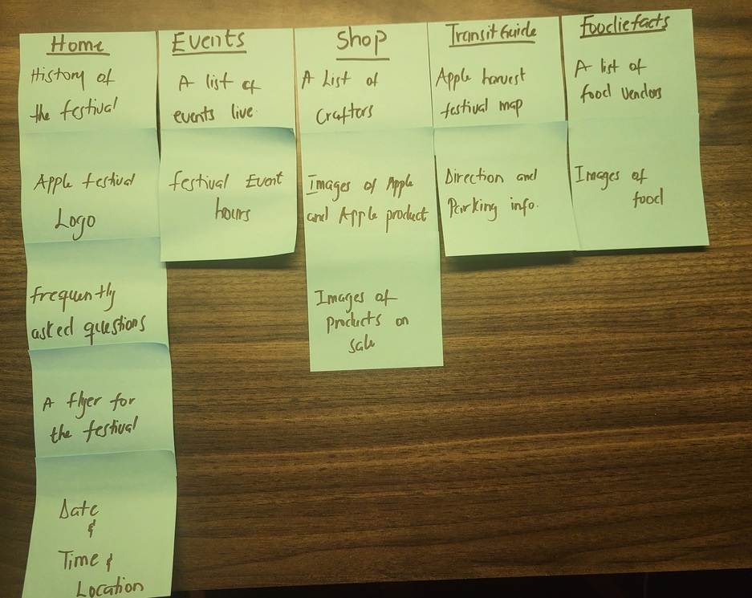

This is my first card sorting, I decided to inclide a flyer a made for the festival on the home page in addition to that i will include a brief hiistory of the festival, provide answers to some frequently asked questions  and include the time and date for the event. provide a list of events, a list of food that will be available at the festival with some images. I will also include a transit guide that has the bus schedule and a list of things to  buy. I grouped my content into five groups.

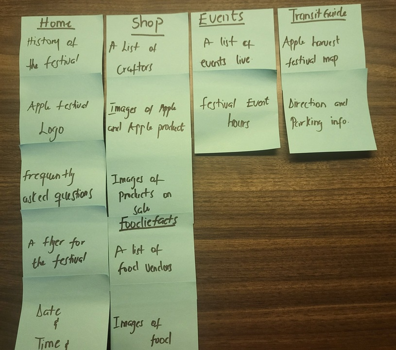

This is my second card sorting, the content has been grouped into 4, it features a homepage, shop and dine, which will have all the content that provides information on shopping and food, the Events page, which will have a list of all the events and time for the events and lastly the transitguide which will contain a map of the festival together with parking and tcat bus schedule.

### Final Content Organization (Milestone 1)
> Which iteration of card sorting will you use for your website?
I will use the first card sorting
> Explain how the final organization of content is appropriate for your site's audiences.

I choose the first card card sorting because I think I have grouped similar content on the same page, this will make navigation within the website clear for my users. It will direct them to the exact information they need.

### Navigation (Milestone 1)
> Please list the pages you will include in your website's navigation.

- Home page
- Event page
- Shop page
- Foodiefact page
- Transitguide page

> Explain why the names of these pages make sense for your site's audience.

I think this name will make sense for my audience because the names are clear, informative, and concise.

## Visual Theme (Milestone 1)
> Discuss several (more than two) ideas about styling your site's theme. Explain why the theme ideas are appropriate for your target audiences. Note the theme you selected for your site and why it's appropriate for the audience and their goals.

1. I want my website to connect to the feeling of my users and make them feel peaceful and relaxed. In order to achieve that, I have decided to use shades of blue for the colre scheme of my website.
2. I want my website to spark the feeling of liveliness and joy in my users, I will use bright colors like orange and yellow to achieve this.
3. I want my website to be less formal and spark liveliness in my users, hence most of the images on the website will have rounded corners and the colour scheme will be a combination of orange and green to effect the feeling.
  Chosen Theme
I will use the 3rd theme because it will be appropriate in meeting the goals of my audience. IThe layoutmakes the website less formal and creates a picture of how welcoming the event will be. The color scheme will also make them feel lively.

## Design (Milestone 1)

Document your site's layout.

### Layout Exploration (Milestone 1)
> Iterate on your site's design through sketching.
> Sketch **both** the **narrow** and **wide** versions of the site.
> Here you are just exploring your layout ideas. You don't need to sketch every page.
> Provide an explanation for each sketch explaining the idea and the design patterns you are leveraging.

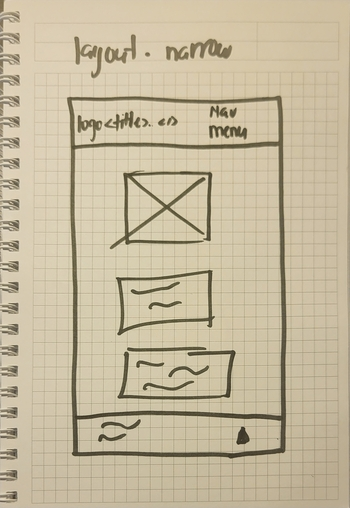

I want to make use of the space available on the wide screen, hence the layout of the main content will be side by side

.jpg)

To make the content readable on a narrow page, I have decided to stack the content on top of the other in order to make it usable.

### Final Design (Milestone 1)
> Include the final sketches for **each** of your pages.
> Include both narrow and wide versions of each page.
> The sketches must include enough detail that another 1300 student could implement them.
> Provide an explanation for each sketch.

**Narrow Design:**

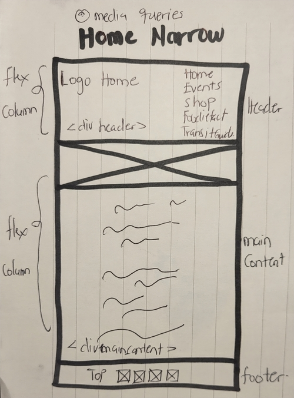

The narrow version of the home page has a navigation bar, the main content and a footer.
The rest of the content which include images and text are all center aligned.

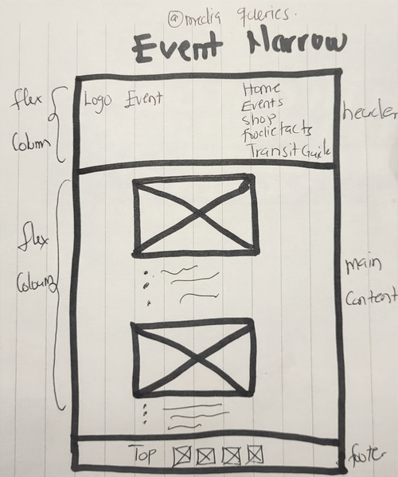

The narrow version of the event page has a navigation bar, the main content and a footer at the bottom of the page. The other content are all center alinged to improve usability.

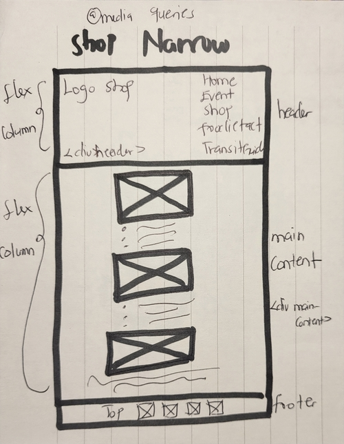

The narrow version of the event page has a navigation bar, the main content and a footer at the bottom of the page.The rest of the content which include images and text are all center aligned.

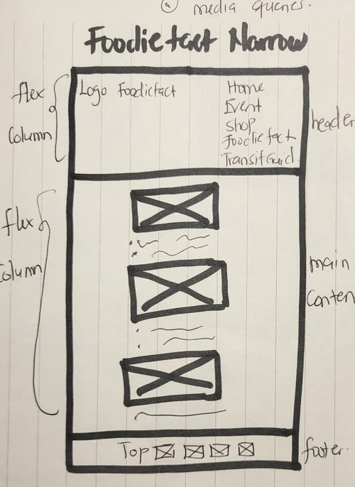

The narrow version of the event page has a navigation bar, the main content and a footer at the bottom of the page.The rest of the content which include images and text are all center aligned.

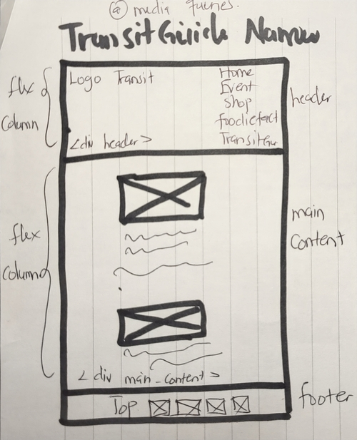

The narrow version of the event page has a navigation bar, the main content and a footer at the bottom of the page.The rest of the content which include images and text are all center aligned.

**Wide Design:**

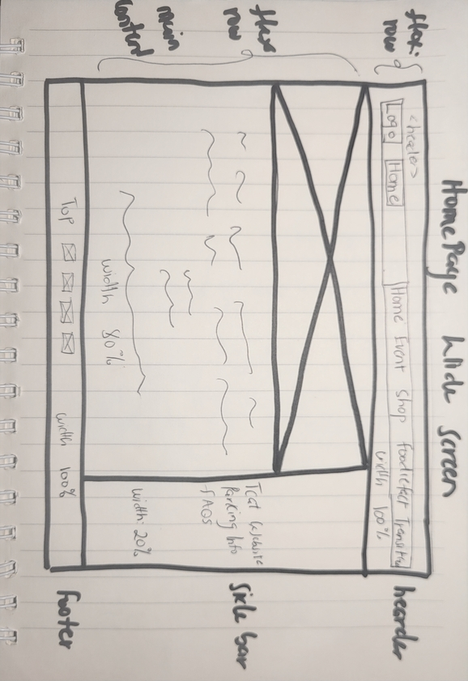

The home page, the navigationbar width is 100%, the main content has a width of 85%, the side bar has a width of 15% and the footer has a width of 100%. I have an image that spans the whole of the main content. The rest of the content on the home page which are mostly text are all center aligned.
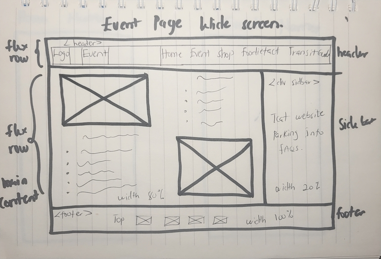

The event page, the navigationbar width is 100%, the main content has a width of 85%, the side bar has a width of 15% and the footer has a width of 100%. The images and the text part of the content are aligned side by side.

With my final design I decide the channge the layout to follow the layout pattern of the other pages. This is to ensure that my design achieve a similar design theme.
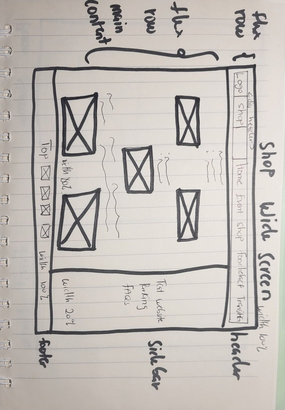

The shop page, the navigationbar width is 100%, the main content has a width of 85%, the side bar has a width of 15% and the footer has a width of 100%. I incleded images of some of the itemsthat will be avaliable for purchase at the festival, I arranged the images in a 2,1,2 format to make it aesthetically pleasing. the text content is also centered.
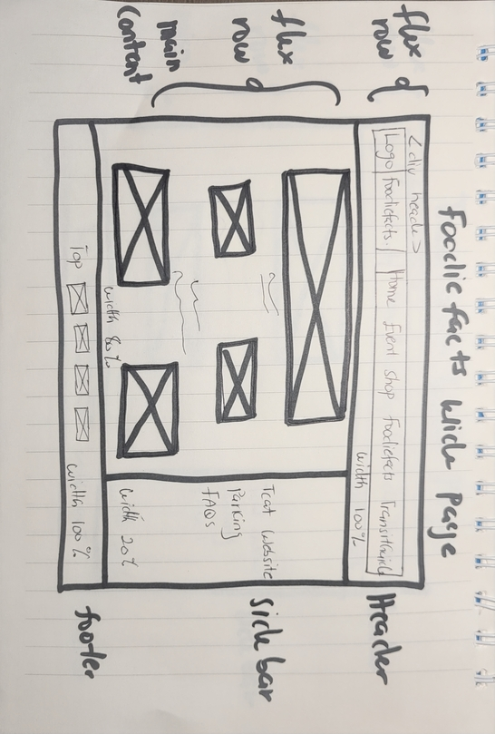

The foodiefact page, the navigationbar width is 100%, the main content has a width of 85%, the side bar has a width of 15% and the footer has a width of 100%. i included image of foods made fromm apples to give my users a glimpse of what to expect at the festival.
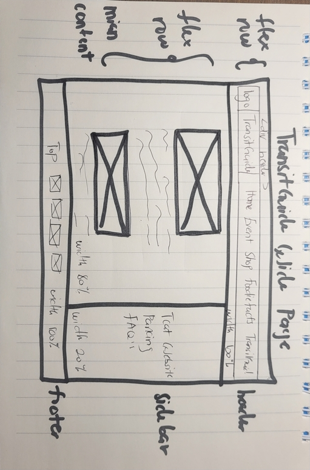

The TransitGuide page, the navigationbar width is 100%, the main content has a width of 85%, the side bar has a width of 15% and the footer has a width of 100%. I centered all the content on this page.

### Design Rationale (Milestone 1)
> Explain why your design is appropriate for your audience.
> Specially, why does your content organization, navigation, and site design/layout meet the goals of your users?
> How did you employ **design patterns** to improve the familiarity of the site for your audience?

My design appropriate for my users because it addresses their needs and meet their goal. My website provide the relevant information my users will need about the Apple Harvest festival. some of these information inclides the time, date and events for the festival. I have also provided information on transportation, things that will be available to purchase the means of purchasing and also a list of food vendors that will be present at the event. I organized the content on my page based on similarity and those that are mostly sort for together, for instance the available means of transportation for people that do not own a car which is mostly the Tcat buses and the bus schedule. I used the same design pattern througout the styling of my all my webpages to ensure consistency.

## Rationale (Final Submission)

**This rationale should be polished writing:** one you might submit as a report to a client or boss to help explain the project and convince them you did a good job. You'll be surprised how much writing and communicating you need to do about projects and choices on internships and jobs; practice that here.

It should be a comprehensive, complete story of the project. You might find that each section runs about a paragraph. Sketches can often help tell the story of your design.

Your rationale should be a polished version of the earlier explanations.

### Audience (Final Submission)
> A complete and polished description of the intended audience(s) for your website.

The audience for my website is a vibrant and diverse community of college students residing in Ithaca. College students are primaerily aged between 18 and 25 with diverseity in ethnicity, background and culture. But they all have one thing in common, they love entertainment and food and they will make it a point to go anywhere these two thing are available.

### Audience Goals
> Explain how your site's design addresses the goals of the audience.
My site provide the goals of my users by proving exactly what my users need. Based on the interview conducted I was able to conclude on the things my users want to see on my website and I included all that content in the creation of my websiteand also,the names of the pages on the navigation bar is clear and concise and it will easily direct my user to the right page to access the information they need.

### Visual Design (Final Submission)
> An explanation of how the final design is appropriate for your audience.
> Include design patterns in your rationale.

My final design integrates all the relevant content my users need to sucessfully attend the Ithaca Apple Festival.
I wanted to make my users feel a glimpse of how they will be at the festival, to accomplis that I used colors that evoke the feeling of outgoing, energy and happiness.

### Self-Reflection (Final Submission)
> Take some time here to reflect on how much you've learned since you started this class. It's often easy to ignore our own progress. Take a moment and think about your accomplishments in this class. Hopefully you'll recognize that you've accomplished a lot and that you should be very proud of those accomplishments!

I have actually improved alot on my skills as compared to the first project. I have improved on my trouble shooting skills using the Inspector tool.

## Grading (Final Submission)

### Collaborators
> List any persons you collaborated with on this project.
I worked on this project alone with the help of the TA's

### Reference Resources
> Please cite any external resources you referenced in the creation of your project.
> (i.e. W3Schools, StackOverflow, Mozilla, etc.)

-Mozillia Documentation
-W3Schools
